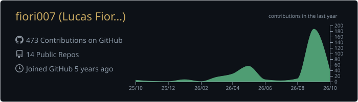
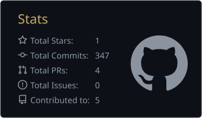
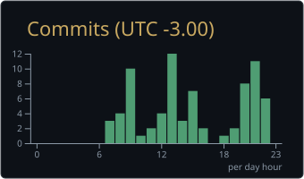
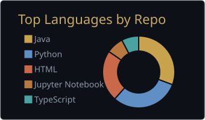
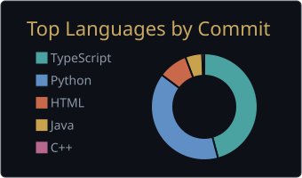

<a href="https://github.com/fiori007">
  <picture>
    <source media="(prefers-color-scheme: dark)" srcset="https://raw.githubusercontent.com/fiori007/fiori007/main/dark_mode.svg">
    
  </picture>
</a>

## ▪ Night log

  

  
  

  
  

  

  

