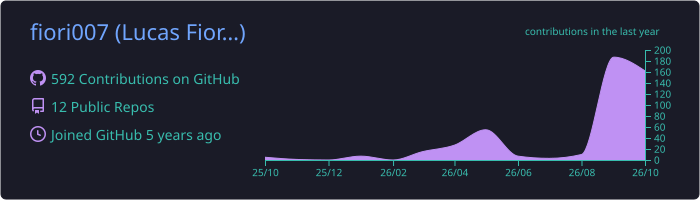
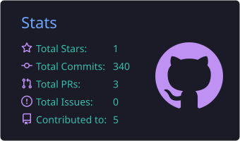
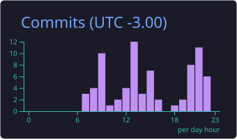
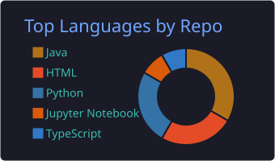
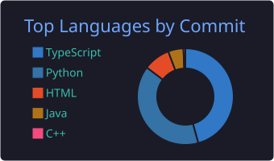

<!-- ═══════════════════════════ HEADER ═══════════════════════════ -->
<p align="center">
  
</p>

<p align="center">
  <a href="https://fiori007.github.io/portfolio/">
    
  </a>
</p>

<p align="center">
  <a href="https://fiori007.github.io/portfolio/"></a>
  <a href="https://www.linkedin.com/in/lucas-fiori/"></a>
  <a href="mailto:lucasfmm54@gmail.com"></a>
  
</p>

<br/>

<p align="center">
  
</p>

<!-- ═══════════════════════════ ABOUT ═══════════════════════════ -->
##  About me

I'm a **Computer Science graduate** and a genuine tech enthusiast. I like the whole journey — understanding a problem, shaping the data, writing the code and watching it run on its own. Most of what I build lives where **data, software, automation and AI** meet, and I'm always picking up something new along the way.

```python
class LucasFiori:
    degree    = "B.Sc. in Computer Science — PUC Minas (graduated 2026)"
    loves     = ["Data", "Software Engineering", "Automation", "Artificial Intelligence"]
    languages = {"Portuguese": "native", "English": "advanced", "Spanish": "intermediate"}
    learning  = ["Agentic AI & MCP", "Cloud (AWS / Azure)", "Modern web with React"]
    fun_fact  = "Spent a full year living in the United States 🇺🇸"

    def say_hi(self) -> str:
        return "Thanks for stopping by — let's build something useful together! 🚀"
```

- 🔭 Exploring **LLMs, AI agents and the Model Context Protocol (MCP)**
- ⚙️ Big fan of **automation** — if I do something twice, I write a script for it
- 📊 Enjoy turning raw data into **dashboards and insights**
- 🌐 Comfortable working and collaborating **in English**
- 💬 Ask me about **Python, SQL, data pipelines, Power BI or n8n**

<!-- ═══════════════════════════ STACK ═══════════════════════════ -->
##  Tech stack

<table align="center">
  <tr>
    <td align="center"><b>Languages</b></td>
    <td></td>
  </tr>
  <tr>
    <td align="center"><b>Data & AI</b></td>
    <td>
      <br/>
      
      
      
      
      
      
      
    </td>
  </tr>
  <tr>
    <td align="center"><b>Web & Mobile</b></td>
    <td></td>
  </tr>
  <tr>
    <td align="center"><b>Automation</b></td>
    <td>
      
      
      
      
    </td>
  </tr>
  <tr>
    <td align="center"><b>Cloud & Tools</b></td>
    <td></td>
  </tr>
</table>

<!-- ═══════════════════════════ PROJECTS ═══════════════════════════ -->
##  Featured projects

<p align="center">
  <a href="https://github.com/fiori007/tcc-call2go"></a>
  <a href="https://github.com/fiori007/n8n-random-node"></a>
  <a href="https://github.com/fiori007/Classificador-de-Osteoartrose"></a>
  <a href="https://github.com/fiori007/Analise-Preditiva-de-Prefer-ncias-Musicais-com-Dados-do-Spotify"></a>
  <a href="https://github.com/fiori007/Aplicativo-Risco-UV"></a>
  <a href="https://github.com/fiori007/portfolio"></a>
</p>

| Project | What it is | Stack |
|---|---|---|
| 🎵 **[Call2Go Detection](https://github.com/fiori007/tcc-call2go)** | Undergraduate thesis — a 20-step cross-platform data pipeline (YouTube · Spotify · Last.fm) with a validated detector and 95 unit tests | Python · SQLite · scikit-learn · pytest |
| 🎲 **[n8n Random Node](https://github.com/fiori007/n8n-random-node)** | Open-source custom node for n8n that generates true random numbers via the Random.org API | TypeScript · Node.js · Docker |
| 🦴 **[Knee Osteoarthritis Classifier](https://github.com/fiori007/Classificador-de-Osteoartrose)** | CNN that classifies knee X-rays, with an OpenCV preprocessing pipeline and a web dashboard | TensorFlow · OpenCV · Dash · Azure |
| 🎧 **[Music Preference Prediction](https://github.com/fiori007/Analise-Preditiva-de-Prefer-ncias-Musicais-com-Dados-do-Spotify)** | Predicting music taste from Spotify listening data with gradient-boosting models | Python · scikit-learn · XGBoost |
| ☀️ **[UV Risk App](https://github.com/fiori007/Aplicativo-Risco-UV)** | Mobile app that warns about UV exposure risk by skin type | Flutter · Dart |
| 🌐 **[Portfolio](https://fiori007.github.io/portfolio/)** | My personal site — hand-built, no frameworks, bilingual EN/PT | HTML · CSS · JavaScript |

<!-- ═══════════════════════════ CERTS ═══════════════════════════ -->
##  Certifications

<p align="center">
  <a href="https://www.credly.com/go/A2QO8AxO"></a>
  <a href="https://www.credly.com/badges/1e5ad2f1-54df-4c3c-b9ee-c52059afe723"></a>
  <a href="https://www.credly.com/badges/8b39ea23-047c-470a-bd11-857ee7f879b5"></a>
  <br/>
  
  
  
</p>

<!-- ═══════════════════════════ STATS ═══════════════════════════ -->
##  GitHub in numbers

<p align="center">
  
</p>

<p align="center">
  
  
</p>

<p align="center">
  
  
</p>

<p align="center">
  
</p>

<!-- ═══════════════════════════ SNAKE ═══════════════════════════ -->
<p align="center">
  <picture>
    <source media="(prefers-color-scheme: dark)" srcset="https://raw.githubusercontent.com/fiori007/fiori007/output/github-contribution-grid-snake-dark.svg"/>
    <source media="(prefers-color-scheme: light)" srcset="https://raw.githubusercontent.com/fiori007/fiori007/output/github-contribution-grid-snake.svg"/>
    
  </picture>
</p>

<!-- ═══════════════════════════ FOOTER ═══════════════════════════ -->
<p align="center">
  
</p>


