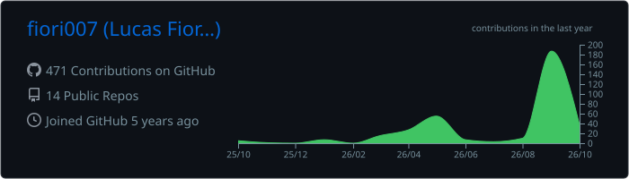
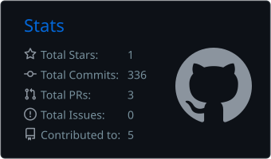
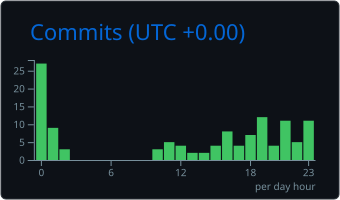
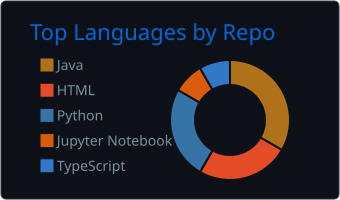
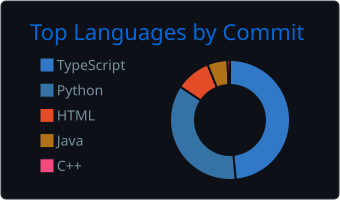

<p align="center">
  
</p>

<p align="center">
  
</p>

<p align="center">
  <a href="https://fiori007.github.io/portfolio/"></a>
  <a href="https://www.linkedin.com/in/lucas-fiori/"></a>
  <a href="mailto:lucasfmm54@gmail.com"></a>
  
</p>

<br/>

<p align="center">
  
</p>

<br/>

## ▪ About

I'm a **Computer Science graduate** and a tech enthusiast who enjoys the quiet part of the work — the hours spent turning scattered data and half-formed ideas into something that runs on its own. My corner of the city is where **data, software, automation and AI** cross paths.

```
 ▸ Exploring LLMs, AI agents and the Model Context Protocol
 ▸ If I have to do something twice, I automate it
 ▸ Turning raw data into dashboards that actually get read
 ▸ Comfortable working and collaborating in English
 ▸ Always learning something new — usually late at night
```

<br/>

## ▪ Arsenal

<table align="center">
  <tr>
    <td align="center" width="140"><sub><b>LANGUAGES</b></sub></td>
    <td></td>
  </tr>
  <tr>
    <td align="center"><sub><b>DATA & AI</b></sub></td>
    <td>
      <br/>
      
      
      
      
      
      
      
    </td>
  </tr>
  <tr>
    <td align="center"><sub><b>WEB & MOBILE</b></sub></td>
    <td></td>
  </tr>
  <tr>
    <td align="center"><sub><b>AUTOMATION</b></sub></td>
    <td>
      
      
      
      
    </td>
  </tr>
  <tr>
    <td align="center"><sub><b>CLOUD & TOOLS</b></sub></td>
    <td></td>
  </tr>
</table>

<br/>

## ▪ Case files

| | Project | What it is | Stack |
|:-:|---|---|---|
| ◾ | **[Call2Go Detection](https://github.com/fiori007/tcc-call2go)** | Undergraduate thesis — a 20-step cross-platform data pipeline (YouTube · Spotify · Last.fm) with a validated detector and 95 unit tests | Python · SQLite · scikit-learn · pytest |
| ◾ | **[n8n Random Node](https://github.com/fiori007/n8n-random-node)** | Open-source custom node for n8n that generates true random numbers via the Random.org API | TypeScript · Node.js · Docker |
| ◾ | **[Knee Osteoarthritis Classifier](https://github.com/fiori007/Classificador-de-Osteoartrose)** | CNN that classifies knee X-rays, with an OpenCV preprocessing pipeline and a web dashboard | TensorFlow · OpenCV · Dash · Azure |
| ◾ | **[Music Preference Prediction](https://github.com/fiori007/Analise-Preditiva-de-Prefer-ncias-Musicais-com-Dados-do-Spotify)** | Predicting music taste from Spotify listening data with gradient-boosting models | Python · scikit-learn · XGBoost |
| ◾ | **[UV Risk App](https://github.com/fiori007/Aplicativo-Risco-UV)** | Mobile app that warns about UV exposure risk by skin type | Flutter · Dart |
| ◾ | **[Portfolio](https://fiori007.github.io/portfolio/)** | Personal site — hand-built, no frameworks, bilingual EN/PT | HTML · CSS · JavaScript |

<br/>

## ▪ Night log

<p align="center">
  
</p>

<p align="center">
  
  
</p>

<p align="center">
  
  
</p>

<p align="center">
  
</p>

<p align="center">
  
</p>

<p align="center">
  
</p>
